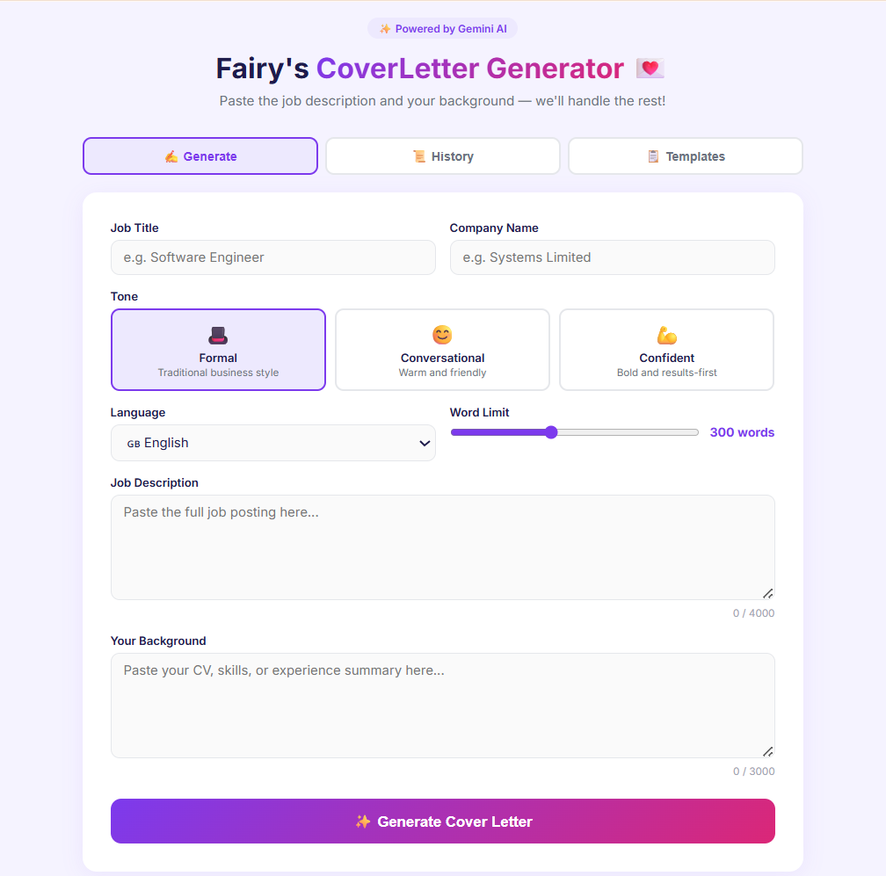
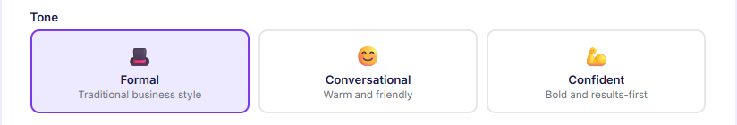
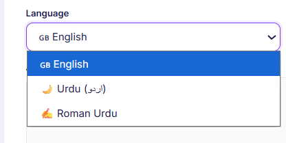
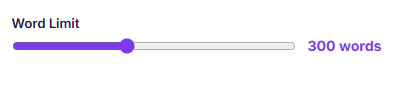
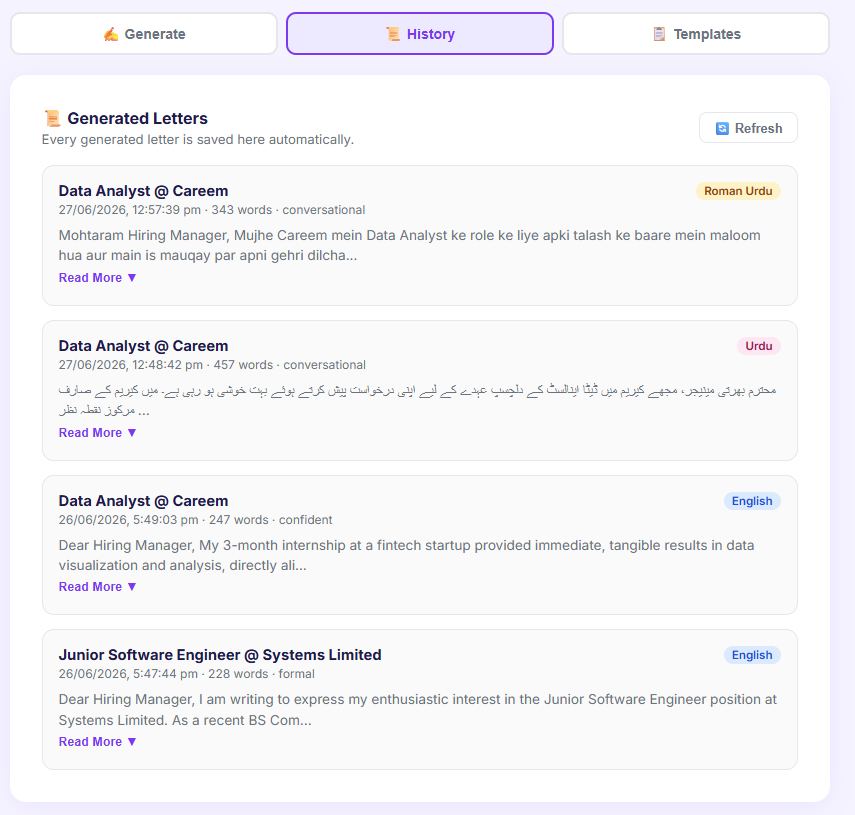
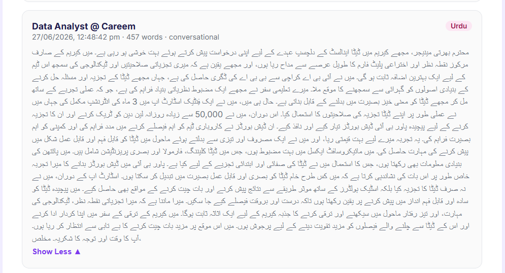
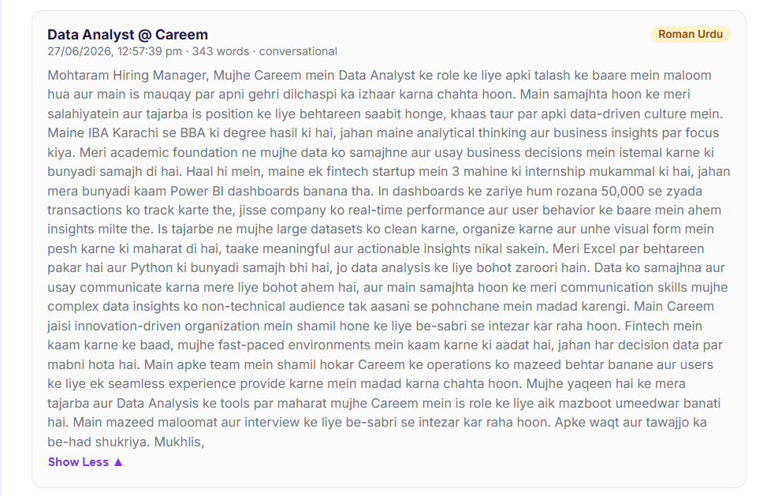
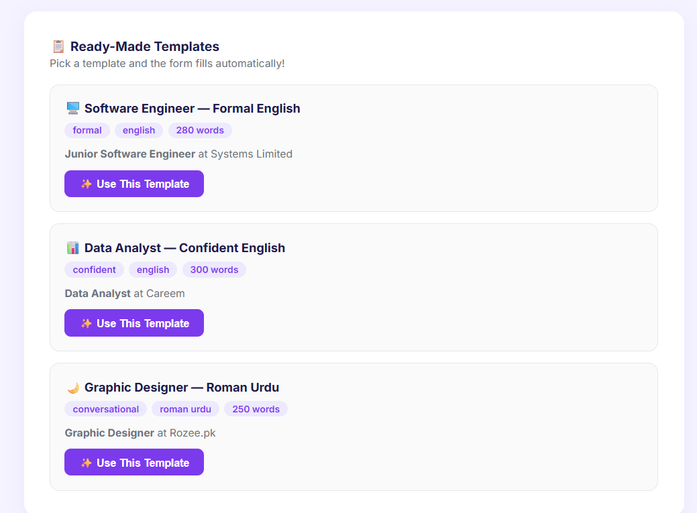

# Fairy's Cover Letter Generator

A FastAPI service that generates tailored, professional cover letters in seconds, powered by Gemini AI.



---

## Key Features

- Generates customized cover letters in seconds
- Multiple writing tones: Formal, Conversational, and Confident
- Adjustable word limit
- Multi-language support (English, Urdu, Roman Urdu)
- Ready-made templates to get started quickly
- History tab to review all previously generated letters
- Clean, user-friendly, and configurable interface

---

## Tech Stack


---

## Screenshots

### Tone Selection
Choose between Formal, Conversational, and Confident writing styles.



### Language and Word Limit
Select your preferred language and control the length of the output.




### History
Every generated letter is saved automatically and accessible from the History tab.



### Output Sample - Urdu


### Output Sample - Roman Urdu


### Ready-Made Templates
Pick a template and the form fills automatically.



---

## Setup

```bash
pip install -r requirements.txt
cp .env.example .env
# Add your Gemini API key to .env
```

---

## Run

```bash
uvicorn app.main:app --reload
```

Then open your browser at: http://localhost:8000

---

## Test (in a second terminal)

```bash
curl -N -X POST http://localhost:8000/generate \
  -H "Content-Type: application/json" \
  -d '{
    "job_title": "Python Developer",
    "company_name": "Systems Ltd",
    "job_description": "Looking for a Python developer with FastAPI experience.",
    "candidate_background": "Final-year CS student, built 3 AI projects.",
    "tone": "confident"
  }'
```

---

## Health Check

```bash
curl http://localhost:8000/health
```

---

## Interactive API Docs

Open http://localhost:8000/docs in your browser.

---

## What I Learned

One of the most valuable parts of building this project was learning how to solve real-world development challenges. During development, I had to debug production issues and migrate to a supported Gemini model, moving to Gemini 2.5 Flash after older Gemini 1.x models were retired. Experiences like these taught me that building AI applications is as much about adapting and troubleshooting as it is about writing code.

This project strengthened my understanding of:

- Prompt Engineering
- LLM Integration
- API Handling
- Frontend-Backend Communication
- Debugging and Problem Solving
- Building AI-powered Web Applications

---

## Author

**swerabuttar-lgtm** - [GitHub](https://github.com/swerabuttar-lgtm)
